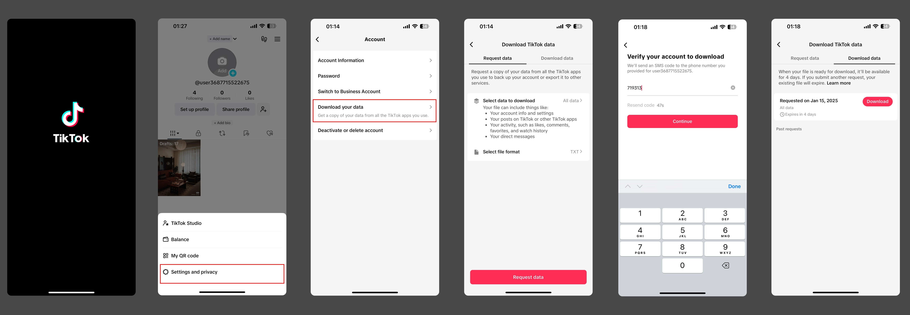
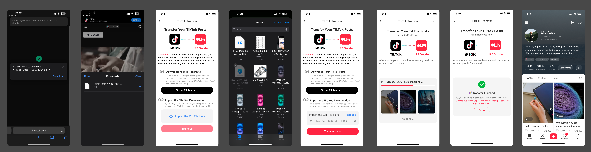

# tiktok-transfer-ui

[**🔄 TikTok Posts Transfer Tool**](https://bit.ly/42fUyzR)

Easily transfer all your TikTok posts with just one click. Switching platforms has never been this simple—just follow a few steps!

**Step 1: Download Your TikTok Posts**

1. Go to **Profile**.
2. Tap the top-right menu and select **Settings and Privacy**.
3. Navigate to **Account > Download Your Data**.
4. Follow the instructions and ensure you select ONLY the "Posts" option for downloading.



**Step 2: Import the File You Downloaded**

- Upload the downloaded ZIP file into the tool.



**Step 3: Wait for Your Posts to Be Imported**

🟢🟢🔘🔘🔘🔘

🎉 **Transfer Complete!** All your posts have been successfully transferred.

**Statement:**

> This tool is designed with your data privacy in mind. It exclusively facilitates the transfer of your posts and does not access, read, or retain any other information. All data is permanently deleted immediately after the transfer process.

## Setup

Install the dependencies:

```bash
pnpm install
```

## Get Started

Start the dev server:

```bash
pnpm dev
```

Build the app for production:

```bash
pnpm build
```

Preview the production build locally:

```bash
pnpm preview
```
